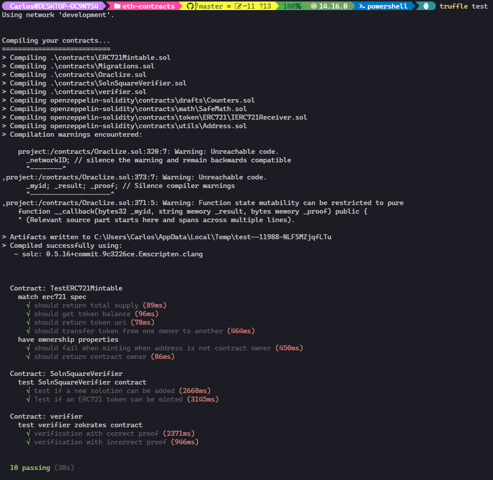

# Real Estate Marketplace

In this project we will use Ethereum smart contracts in combination with other frameworks and services to develop a ERC721 contract that allows us to create a decentralized house listing service. The minted tokens would be listed in OpenSea and available to be bought in the Rinkeby test network.

## Installation

To install, download or clone the repo, then:
```bash
npm install
cd eth-contracts
truffle compile
```

## Test smart contracts

Open a terminal and run this command:
```bash
ganache-cli
```

Open a second terminal and execute:
```bash
truffle test
```

The result must be similar to this:



## ZoKrates

This repository already contains 10 pre-generated proofs that I have used to mint 10 tokens. In case you require more you can do it following next steps:

* Step 1: Install and execute Docker
* Step 2: Run ZoKrates
  ```
  docker run -v <path-to-your-project>/zokrates/code>:/home/zokrates/code -ti zokrates/zokrates /bin/bash
  ```

  Change into the square directory
  ``` 
  cd code/square/
  ``` 

* Step 3: Compile the program written in ZoKrates DSL
  ``` 
  ~/zokrates compile -i square.code
  ``` 

* Step 4: Generate the trusted setup
  ``` 
  ~/zokrates setup
  ```

* Step 5: Compute witness
  ``` 
  ~/zokrates compute-witness -a 3 9
  ```

* Step 6: Generate proof
  ```
  ~/zokrates generate-proof
  ```

* Step 7: Export verifier
  ```  
  ~/zokrates export-verifier
  ```

Re-run steps 5 and 6 with different arguments, e.g. 1 2, to generate additional proofs for minting tokens. You must move the new file "proof.json" from "zokrates/code/square" to "scripts" folder before any new re-run of those steps to avoid overwrite it and because we will use it inside our "mint.js" script.

## Deployment to Rinkeby

Edit the file eth-contracts/.env with the required property values, then open a terminal and execute the next commands:

```bash
cd eth-contracts
truffle console --network rinkeby
# inside truffle console
migrate --reset
```

## Deployed smart contracts

My smart contracts have the following addresses:

| Contract | Address |
|---|---|
|  *Migrations* | [0x0d8cb9b27258885fB6CEca2ce3A532E62bbD8a9B](https://rinkeby.etherscan.io/address/0x0d8cb9b27258885fB6CEca2ce3A532E62bbD8a9B) |
|  *Verifier* | [0xB3a8420892EF98E6815A512584628c5453577738](https://rinkeby.etherscan.io/address/0xB3a8420892EF98E6815A512584628c5453577738) |
|  *SolnSquareVerifier* | [0x1cCE51c6d18261B9AdD536dcAb5Fe270b04a2726](https://rinkeby.etherscan.io/address/0x1cCE51c6d18261B9AdD536dcAb5Fe270b04a2726) |

SolnSquareVerifier contract ABI:
```
[{"anonymous":false,"inputs":[{"indexed":true,"internalType":"address","name":"owner","type":"address"},{"indexed":true,"internalType":"address","name":"approved","type":"address"},{"indexed":true,"internalType":"uint256","name":"tokenId","type":"uint256"}],"name":"Approval","type":"event"},{"anonymous":false,"inputs":[{"indexed":true,"internalType":"address","name":"owner","type":"address"},{"indexed":true,"internalType":"address","name":"operator","type":"address"},{"indexed":false,"internalType":"bool","name":"approved","type":"bool"}],"name":"ApprovalForAll","type":"event"},{"anonymous":false,"inputs":[{"indexed":false,"internalType":"address","name":"caller","type":"address"}],"name":"Paused","type":"event"},{"anonymous":false,"inputs":[{"indexed":false,"internalType":"bytes32","name":"key","type":"bytes32"},{"indexed":false,"internalType":"address","name":"addr","type":"address"},{"indexed":false,"internalType":"uint256","name":"tokenId","type":"uint256"}],"name":"SolutionAdded","type":"event"},{"anonymous":false,"inputs":[{"indexed":true,"internalType":"address","name":"from","type":"address"},{"indexed":true,"internalType":"address","name":"to","type":"address"},{"indexed":true,"internalType":"uint256","name":"tokenId","type":"uint256"}],"name":"Transfer","type":"event"},{"anonymous":false,"inputs":[{"indexed":false,"internalType":"address","name":"caller","type":"address"}],"name":"Unpaused","type":"event"},{"anonymous":false,"inputs":[{"indexed":false,"internalType":"string","name":"s","type":"string"}],"name":"Verified","type":"event"},{"anonymous":false,"inputs":[{"indexed":false,"internalType":"address","name":"oldOwner","type":"address"},{"indexed":false,"internalType":"address","name":"newOwner","type":"address"}],"name":"ownerShipTransfered","type":"event"},{"constant":false,"inputs":[{"internalType":"bytes32","name":"_myid","type":"bytes32"},{"internalType":"string","name":"_result","type":"string"}],"name":"__callback","outputs":[],"payable":false,"stateMutability":"nonpayable","type":"function"},{"constant":false,"inputs":[{"internalType":"bytes32","name":"_myid","type":"bytes32"},{"internalType":"string","name":"_result","type":"string"},{"internalType":"bytes","name":"_proof","type":"bytes"}],"name":"__callback","outputs":[],"payable":false,"stateMutability":"nonpayable","type":"function"},{"constant":false,"inputs":[{"internalType":"address","name":"to","type":"address"},{"internalType":"uint256","name":"tokenId","type":"uint256"}],"name":"approve","outputs":[],"payable":false,"stateMutability":"nonpayable","type":"function"},{"constant":true,"inputs":[{"internalType":"address","name":"owner","type":"address"}],"name":"balanceOf","outputs":[{"internalType":"uint256","name":"","type":"uint256"}],"payable":false,"stateMutability":"view","type":"function"},{"constant":true,"inputs":[],"name":"baseTokenURI","outputs":[{"internalType":"string","name":"","type":"string"}],"payable":false,"stateMutability":"view","type":"function"},{"constant":true,"inputs":[{"internalType":"uint256","name":"tokenId","type":"uint256"}],"name":"getApproved","outputs":[{"internalType":"address","name":"","type":"address"}],"payable":false,"stateMutability":"view","type":"function"},{"constant":true,"inputs":[{"internalType":"address","name":"owner","type":"address"},{"internalType":"address","name":"operator","type":"address"}],"name":"isApprovedForAll","outputs":[{"internalType":"bool","name":"","type":"bool"}],"payable":false,"stateMutability":"view","type":"function"},{"constant":true,"inputs":[],"name":"name","outputs":[{"internalType":"string","name":"","type":"string"}],"payable":false,"stateMutability":"view","type":"function"},{"constant":true,"inputs":[],"name":"owner","outputs":[{"internalType":"address","name":"","type":"address"}],"payable":false,"stateMutability":"view","type":"function"},{"constant":true,"inputs":[{"internalType":"uint256","name":"tokenId","type":"uint256"}],"name":"ownerOf","outputs":[{"internalType":"address","name":"","type":"address"}],"payable":false,"stateMutability":"view","type":"function"},{"constant":false,"inputs":[{"internalType":"address","name":"from","type":"address"},{"internalType":"address","name":"to","type":"address"},{"internalType":"uint256","name":"tokenId","type":"uint256"}],"name":"safeTransferFrom","outputs":[],"payable":false,"stateMutability":"nonpayable","type":"function"},{"constant":false,"inputs":[{"internalType":"address","name":"from","type":"address"},{"internalType":"address","name":"to","type":"address"},{"internalType":"uint256","name":"tokenId","type":"uint256"},{"internalType":"bytes","name":"_data","type":"bytes"}],"name":"safeTransferFrom","outputs":[],"payable":false,"stateMutability":"nonpayable","type":"function"},{"constant":false,"inputs":[{"internalType":"address","name":"to","type":"address"},{"internalType":"bool","name":"approved","type":"bool"}],"name":"setApprovalForAll","outputs":[],"payable":false,"stateMutability":"nonpayable","type":"function"},{"constant":false,"inputs":[{"internalType":"bool","name":"paused","type":"bool"}],"name":"setPaused","outputs":[],"payable":false,"stateMutability":"nonpayable","type":"function"},{"constant":true,"inputs":[{"internalType":"bytes4","name":"interfaceId","type":"bytes4"}],"name":"supportsInterface","outputs":[{"internalType":"bool","name":"","type":"bool"}],"payable":false,"stateMutability":"view","type":"function"},{"constant":true,"inputs":[],"name":"symbol","outputs":[{"internalType":"string","name":"","type":"string"}],"payable":false,"stateMutability":"view","type":"function"},{"constant":true,"inputs":[{"internalType":"uint256","name":"index","type":"uint256"}],"name":"tokenByIndex","outputs":[{"internalType":"uint256","name":"","type":"uint256"}],"payable":false,"stateMutability":"view","type":"function"},{"constant":true,"inputs":[{"internalType":"address","name":"owner","type":"address"},{"internalType":"uint256","name":"index","type":"uint256"}],"name":"tokenOfOwnerByIndex","outputs":[{"internalType":"uint256","name":"","type":"uint256"}],"payable":false,"stateMutability":"view","type":"function"},{"constant":true,"inputs":[{"internalType":"uint256","name":"tokenId","type":"uint256"}],"name":"tokenURI","outputs":[{"internalType":"string","name":"","type":"string"}],"payable":false,"stateMutability":"view","type":"function"},{"constant":true,"inputs":[],"name":"totalSupply","outputs":[{"internalType":"uint256","name":"","type":"uint256"}],"payable":false,"stateMutability":"view","type":"function"},{"constant":false,"inputs":[{"internalType":"address","name":"from","type":"address"},{"internalType":"address","name":"to","type":"address"},{"internalType":"uint256","name":"tokenId","type":"uint256"}],"name":"transferFrom","outputs":[],"payable":false,"stateMutability":"nonpayable","type":"function"},{"constant":false,"inputs":[{"internalType":"address","name":"newOwner","type":"address"}],"name":"transferOwnership","outputs":[],"payable":false,"stateMutability":"nonpayable","type":"function"},{"constant":false,"inputs":[{"internalType":"uint256[2]","name":"a","type":"uint256[2]"},{"internalType":"uint256[2]","name":"a_p","type":"uint256[2]"},{"internalType":"uint256[2][2]","name":"b","type":"uint256[2][2]"},{"internalType":"uint256[2]","name":"b_p","type":"uint256[2]"},{"internalType":"uint256[2]","name":"c","type":"uint256[2]"},{"internalType":"uint256[2]","name":"c_p","type":"uint256[2]"},{"internalType":"uint256[2]","name":"h","type":"uint256[2]"},{"internalType":"uint256[2]","name":"k","type":"uint256[2]"},{"internalType":"uint256[2]","name":"input","type":"uint256[2]"}],"name":"verifyTx","outputs":[{"internalType":"bool","name":"r","type":"bool"}],"payable":false,"stateMutability":"nonpayable","type":"function"},{"constant":false,"inputs":[{"internalType":"address","name":"addr","type":"address"},{"internalType":"uint256","name":"tokenId","type":"uint256"},{"internalType":"uint256[2]","name":"a","type":"uint256[2]"},{"internalType":"uint256[2]","name":"a_p","type":"uint256[2]"},{"internalType":"uint256[2][2]","name":"b","type":"uint256[2][2]"},{"internalType":"uint256[2]","name":"b_p","type":"uint256[2]"},{"internalType":"uint256[2]","name":"c","type":"uint256[2]"},{"internalType":"uint256[2]","name":"c_p","type":"uint256[2]"},{"internalType":"uint256[2]","name":"h","type":"uint256[2]"},{"internalType":"uint256[2]","name":"k","type":"uint256[2]"},{"internalType":"uint256[2]","name":"input","type":"uint256[2]"}],"name":"addSolution","outputs":[],"payable":false,"stateMutability":"nonpayable","type":"function"},{"constant":false,"inputs":[{"internalType":"address","name":"addr","type":"address"},{"internalType":"uint256","name":"tokenId","type":"uint256"}],"name":"mint","outputs":[{"internalType":"bool","name":"","type":"bool"}],"payable":false,"stateMutability":"nonpayable","type":"function"}]
```

## Mint Tokens

Open new terminal in project's root:
```bash
cd scripts
node mint.js
```

Minting process will begin. It could take some time to finish. Once that the process ends to mint 10 tokens you can kill process or terminal. In my case here are the details on [Etherscan](https://rinkeby.etherscan.io/address/0x1cCE51c6d18261B9AdD536dcAb5Fe270b04a2726).

## OpenSea Details

My Marketplace: [Link](https://testnets.opensea.io/collection/my-real-estate-token)

Purchase transactions:
* [0x05fd56031290466d939dac9d3d13e924031ec5fe46ed8fc8ad4356f9dfab7021](https://rinkeby.etherscan.io/tx/0x05fd56031290466d939dac9d3d13e924031ec5fe46ed8fc8ad4356f9dfab7021)
* [0xe51c7eb678347d274dcb46af4c2af95bcc90ed8a06ec2dbc97062f6ba3c69688](https://rinkeby.etherscan.io/tx/0xe51c7eb678347d274dcb46af4c2af95bcc90ed8a06ec2dbc97062f6ba3c69688)
* [0xde800cdbbaf2050b6e59bc945efc7552c411f0aab628a63d37a96e40843abc7c](https://rinkeby.etherscan.io/tx/0xde800cdbbaf2050b6e59bc945efc7552c411f0aab628a63d37a96e40843abc7c)
* [0xa677b09f39514747357239e3ddaa3b73b909fe7173580593929d00a76d4a2178](https://rinkeby.etherscan.io/tx/0xa677b09f39514747357239e3ddaa3b73b909fe7173580593929d00a76d4a2178)
* [0x34da55a3feb2464cff53fc3d0ec4c027e36a3411d9d7dd6d195a01f8bd9cc56a](https://rinkeby.etherscan.io/tx/0x34da55a3feb2464cff53fc3d0ec4c027e36a3411d9d7dd6d195a01f8bd9cc56a)

purchaser's address: [0xecb58770a5b5b8974642bdddc92be2340ed71653](https://rinkeby.etherscan.io/address/0xecb58770a5b5b8974642bdddc92be2340ed71653)


## Project Resources

* [Remix - Solidity IDE](https://remix.ethereum.org/)
* [Visual Studio Code](https://code.visualstudio.com/)
* [Truffle Framework](https://truffleframework.com/)
* [Ganache - One Click Blockchain](https://truffleframework.com/ganache)
* [Open Zeppelin ](https://openzeppelin.org/)
* [Interactive zero knowledge 3-colorability demonstration](http://web.mit.edu/~ezyang/Public/graph/svg.html)
* [Docker](https://docs.docker.com/install/)
* [ZoKrates](https://github.com/Zokrates/ZoKrates)